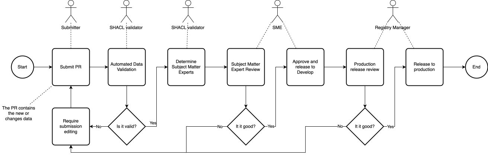

# Geoscience Australia's Vocabularies

This repository contains the source files of Geoscience Australia (GA)'s public vocabularies. 

All these vocabularies - from multiple sources, not just from GA itself - are presented as [Simple Knowledge Organization System (SKOS)](https://www.w3.org/TR/skos-reference/) vocabularies and are delivered online at:

https://vocabs.ga.gov.au/

## Data Management

The data in this repository is managed according to some developing governance procedures, based in general on [ISO 19135 Geographic information - Procedures for item registration](https://www.iso.org/standard/54721.html). This means whole vocabularies and concepts within them are "items" that have explicit or implicit statues and for which changes need to be proposed, accepted, implemented and records in particular ways.

### Governance representation

Within vocabulary data, statuses of objects are either given or implied. All vocabularies have statuses given explicitly.

The _GA Register Data Themes_ vocabulary declares that it's status is `stable`, like this:

```turtle
PREFIX astatus: <https://linked.data.gov.au/def/reg-statuses/>
PREFIX cs: <https://pid.geoscience.gov.au/def/voc/ga/DataThemes>
PREFIX schema: <https://schema.org/>
PREFIX skos: <http://www.w3.org/2004/02/skos/core#>

cs:
    a skos:ConceptScheme ;
    # ...
    schema:status astatus:stable ;
    # ...
.
```

Individual terms within the _GA Register Data Themes_ vocabulary that do not explicitly indicate a status are assumed to carry the same status as their parent - the vocab as a whole but if it's explicitly given, it overrides the parent. For example, a `retired` term within a `stable` vocabulary.

As Concepts within vocabs are altered over time, their statuses will be made explicit.

### Governance workflows

Workflows to ensure that proposed changes are reviewed by authorised reviewers, accepted and so on follow defined workflows as per ISO 19135 and are implemented by GitHub Actions worflows within this repository.

For example, if a change to a vocab is proposed, a technical _Pull Request_ (PR) targeting the vocabulary's file in this repository will be needed. This will make the change details explicit. The PR will then need to be technically validated - an automated process - and then approved by a member of the Data Catalogue Team before the change flows through to the visible vocab content.

The Data Catalogue Team, Subject-Matter Experts and even the people proposing changes - 'Submitters' - all have roles defined by ISO 19135. 

The target state workflow is as below (perhaps not completely implemented yet):



### Technical workflows

GitHub Actions, defined in `.github/workflows/` trigger on the creation of Pull Requests - for validation - and on merge - for pushing to DBs.

The validation workflows triggers on the creation of a PR to the _master_ or _develop_ branches and use [Prez Manifest](https://github.com/Kurrawong/prezmanifest/)'s `validate` command to validate all resources indicated as conforming to profiles in the `manifest.ttl` file. Currently, all vocabs are indicated as conforming to [VocPub](https://linked.data.gov.au/def/vocpub) as per the line `dcterms:conformsTo <https://linked.data.gov.au/def/vocpub/validator> ;`.

The push workflows trigger on merger into _master_ or _develop_ branches uses the Prez Manifest `sync` command which automatically detects what files have changes and pushes only them.

> [!TIP]
> PrezManifest's `sync` command detects changes only based on a resources `schema:dateModified` and `schema:version` predicate values. If there is a problem with change detection, use the [kurra toolkit's GSP commands](https://github.com/kurrawong/kurra) which Prez Manifest uses under-te-hood - to manually override data on the server with files, e.g. `kurra db gsp put {FILE} -g {GRAPH-IRI} {SPARQL-ENDPOINT}`

## License  

Geoscience Australia's vocabularies in this repository are licensed using the [CC BY 4.0](https://creativecommons.org/licenses/by/4.0/) licence. See the [LICENSE file](LICENSE) for the deed. 

Other vocabularies reproduced by GA may have other licensing arrangements. See the individual vocabulary files for details.

## Custodian

[Geoscience Australia](https://www.ga.gov.au)'s Data Catalogue Team 

## Contact

Manager Client Services  
_Geoscience Australia_  
<clientservices@ga.gov.au> 

Cnr Jerrabomberra Ave and Hindmarsh Dr  
GPO Box 378, Canberra, ACT, 2601, Australia

Call 1800 800 173
